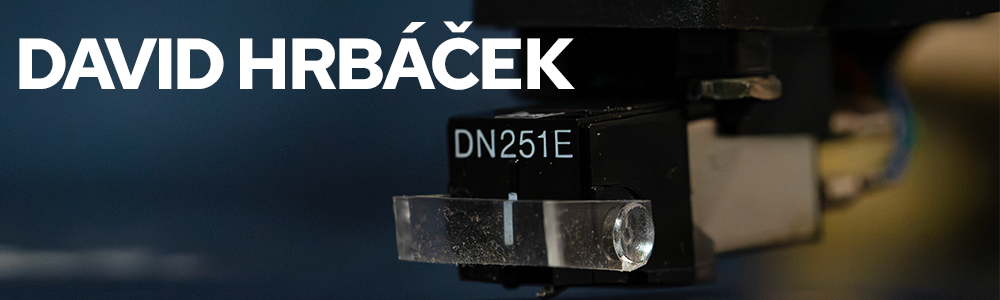

<div align="center">


[](https://www.davidhrbacek.dev/)
[](https://github.com/David-hrb)
[](https://github.com/David-hrb)

</div>

---

## About Me

```ts
const david = {
  role:       "Student focusing in Full-Stack Development & Game Development",
  location:   "Czech Republic 🇨🇿",
  building:   ["Nuxt and Vue Websited", "Games in Unity", "Application"],
  passions:   ["Clean design", "Game design", "Procedural generation"],
  website:    "https://www.davidhrbacek.dev/",
};
```

---

## Tech Stack

### Frontend


### Frameworks & Build Tools


### Backend & Languages


### Game Development


### Databases


---

## GitHub Stats

<div align="center">


&nbsp;


</div>

<div align="center">

</div>
